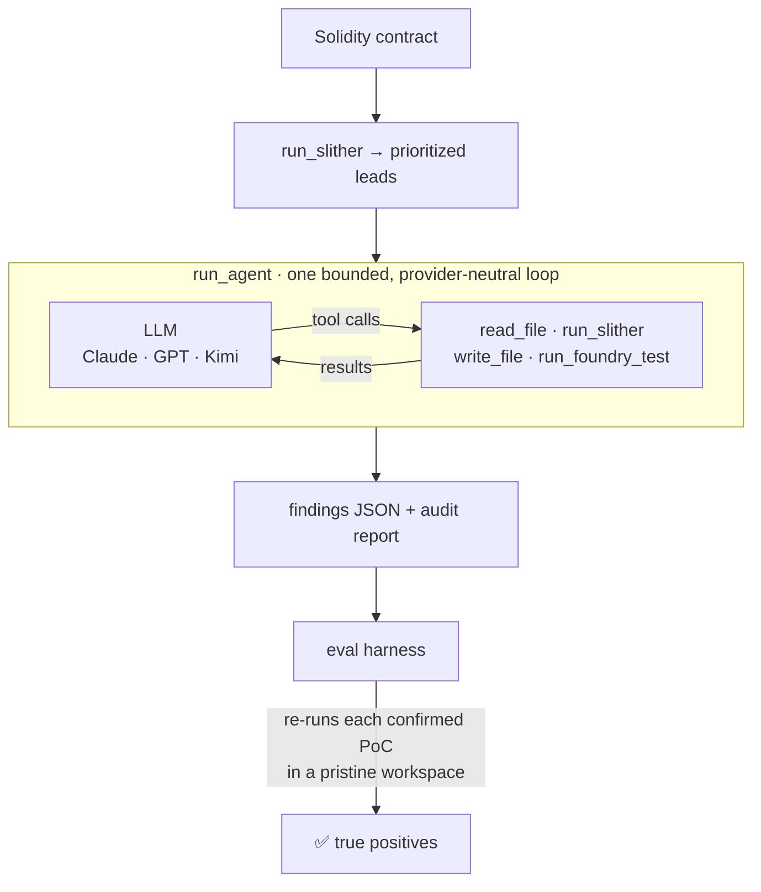

<div align="center">

# Pramana

**A multi-agent smart-contract auditor that proves every vulnerability with an executable exploit.**

No proof-of-concept, no finding. Provider-neutral across Claude, GPT, and Kimi, and measured by an eval harness from day one.

[](https://github.com/divyangchauhan/Pramana/actions/workflows/ci.yml)


</div>

---

Most LLM "audit" tools hand you a wall of plausible-sounding findings and leave you to sort the real bugs from the hallucinations. Pramana takes the opposite stance:

> **A finding is real only when a proof-of-concept exploit executes.**
> For every vulnerability it hypothesises, Pramana writes a [Foundry](https://getfoundry.sh) test that triggers the exploit and runs it. If the test doesn't pass, the finding doesn't ship. Its false-positive rate isn't a vibe — it's whether a PoC executes.

That single design choice — *executable proof over model confidence* — is the line between a demo and something you'd trust. Everything else in the project exists to make that idea reproducible and measurable.

**Pramāṇa** (प्रमाण) is Sanskrit for *"a valid means of knowledge / proof"* — a finding counts as knowledge only once it has been proven.

---

## Results

The headline metric is **true-positive findings confirmed with an executable PoC** — a finding the harness *independently re-runs and watches pass* in a clean workspace, matched to a known real vulnerability.

Full corpus, live run with `claude-opus-4-8`:

| Fixture | Vulnerability class(es) | Known bugs | Proven with PoC | True positives |
|---|---|:---:|:---:|:---:|
| `reentrancy-vault` | reentrancy | 1 | ✅ | 1 |
| `unprotected-owner` | access-control | 1 | ✅ | 1 |
| `tx-origin-wallet` | tx-origin | 1 | ✅ | 1 |
| `unchecked-overflow-token` | integer-overflow | 1 | ✅ | 1 |
| `bank-multi` | reentrancy **+** access-control | 2 | ✅ ✅ | 2 |

**6 / 6 true positives · recall 1.00 · precision 1.00.** Every finding came with a Foundry exploit that the harness re-ran, from scratch, against the untouched target contract — including the composite `bank-multi`, where both distinct bugs were found and proven independently.

An offline `--self-check` reproduces the entire scoring pipeline (workspace build → `forge test` → class match → count) with **no API key required**.

---

## How it works



A single audit, start to finish:

1. **Ground.** [Slither](https://github.com/crytic/slither) runs once and its detector hits seed the agent — *leads to investigate, never findings on their own.*
2. **Investigate.** The agent reads the actual Solidity (`read_file`), traces the flow, and forms a falsifiable exploit hypothesis grounded in code it actually inspected.
3. **Prove.** For each hypothesis it writes a Foundry PoC (`write_file`) and runs it (`run_foundry_test`). Its default assumption is that the claim is *false* — only a passing, assertion-backed test flips it to `confirmed`.
4. **Report.** It emits a strict JSON payload (findings + markdown report), validated at the boundary with Pydantic.
5. **Score.** The harness rebuilds a fresh workspace with the *pristine* target, copies in only the agent's PoC, and re-runs it — so a finding counts only if the exploit truly executes.

Here's a real transcript from the reentrancy audit (`--verbose`), including the agent debugging its own PoC:

```
turn 0  read_file      src/EtherStore.sol
turn 1  write_file     test/F-001.t.sol        # first PoC attempt
turn 2  run_foundry_test                        # ❌ fails: ETH-seeding bug in the test
turn 3  write_file     test/F-001.t.sol        # self-corrected
turn 4  run_foundry_test                        # ✅ passes: vault drained 6→0
turn 5  (final JSON)   confirmed · reentrancy · PoC test/F-001.t.sol
```

---

## Why the design holds up

Three ideas do the heavy lifting — each is a deliberate engineering choice, not an accident of the prototype:

- **Executable verification.** Ground truth is `forge test`, not the model's self-assessment. The harness re-runs each PoC against the *original* contract in an isolated workspace, so the agent can't fake a pass by editing the target. `inconclusive` verdicts and non-passing PoCs never count.
- **Eval-first, not eval-later.** The measurement harness ships in the same slice as the pipeline. Every run produces a reproducible true-positive count plus supporting diagnostics (candidate volume, precision before/after verification, recall) — the instrument for answering *"which model, which prompt, which config actually performs?"* empirically.
- **Provider-neutral core.** The agent loop never imports a lab SDK; it speaks one canonical message/tool format. Swapping Claude ↔ GPT ↔ Kimi is a config change, and adding a lab is one adapter file. This is what lets the eval sweep models instead of betting on one.

---

## The corpus

Five self-contained fixtures, each modeled on a landmark real-world exploit, with a labeled known-bug set and a reference PoC:

| Fixture | Class | Modeled on |
|---|---|---|
| `reentrancy-vault` | reentrancy | The DAO (2016) |
| `unprotected-owner` | access-control | Parity multisig unprotected initializer (2017) |
| `tx-origin-wallet` | tx-origin (SWC-115) | `tx.origin` phishing |
| `unchecked-overflow-token` | integer-overflow | BeautyChain (BEC) `batchOverflow` (2018) |
| `bank-multi` | reentrancy **+** access-control | composite two-bug contract — exercises 1:1 matching |

Each `pramana/eval/datasets/<name>/` holds the vulnerable source (`src/`), a `fixture.json` label set, and a `reference/` exploit PoC that validates the grader offline.

**Negative control.** Recall alone can be gamed by a model that reports everything, so the corpus also ships `reentrancy-vault-patched` — an otherwise identical twin of `reentrancy-vault` whose `withdraw()` applies the effect before the interaction. It declares **zero** known bugs, so every confirmed finding against it is unambiguously a false positive. Its `reference/` holds control tests rather than an exploit, asserting both that the drain now reverts *and* that honest withdrawals still succeed — a degenerate always-revert "fix" would otherwise pass as safe. CI additionally replays the real exploit against the patched twin and requires it to fail, so the control cannot silently rot.

Scaling to public benchmarks (Code4rena / Sherlock / DeFiHackLabs / EVMbench) and a full paired-patch set is on the roadmap.

---

## Quickstart

Requires [`uv`](https://docs.astral.sh/uv/), plus [`forge`](https://getfoundry.sh) (Foundry) and [`slither`](https://github.com/crytic/slither) on `PATH`.

```bash
uv sync                                                       # Python deps
(cd pramana/eval/foundry_template && forge soldeer install)   # restore forge-std
```

`forge-std` is a pinned [Soldeer](https://soldeer.xyz) dependency (`foundry.toml` + `soldeer.lock`) — fetched, not vendored; the harness prints the exact restore command if it's missing.

**Offline self-check** — no API key; grades the reference PoCs to prove the scoring machinery end to end:

```bash
uv run python -m pramana.eval.harness --self-check
```

```
fixture                    cfg                    cand conf  poc+  TP  recall
-----------------------------------------------------------------------------
bank-multi                 reference-poc             2    2     2   2    1.00
reentrancy-vault           reference-poc             1    1     1   1    1.00
reentrancy-vault-patched   reference-poc             0    0     0   0       -
tx-origin-wallet           reference-poc             1    1     1   1    1.00
unchecked-overflow-token   reference-poc             1    1     1   1    1.00
unprotected-owner          reference-poc             1    1     1   1    1.00
-----------------------------------------------------------------------------
HEADLINE — true-positive findings confirmed with executable PoCs: 6 / 6 known bugs
NEGATIVE CONTROLS (1) — false positives: 0 confirmed, 0 with a passing PoC
```

A `recall` of `-` marks a negative control: it has no known bugs, so recall is undefined and the number that matters is its false-positive count.

**Live agent run** — drop your key in `.env` (the app auto-loads it and refuses to start if the selected provider's credential is missing):

```bash
cp .env.example .env         # fill in ANTHROPIC_API_KEY (or OPENAI / MOONSHOT)
uv run python -m pramana.eval.harness --provider anthropic
```

<details>
<summary>More options</summary>

```bash
# other providers (pass a valid model id)
uv run python -m pramana.eval.harness --provider openai --model <model-id>
uv run python -m pramana.eval.harness --provider kimi   --model <kimi-k3-id>

# handy flags
--fixtures reentrancy-vault tx-origin-wallet   # restrict the set
--json results.json                            # full per-finding results
--report-dir ./reports                         # write a per-fixture audit report.md
--verbose                                      # stream tool calls to stderr
--work-dir ./runs                              # keep workspaces (agent PoCs) to inspect
--forge-retries 3                              # retries for transient forge/anvil flakiness
```

</details>

---

## Providers

The core depends only on the canonical types in `providers/base.py`; each adapter is the sole file that touches a vendor SDK.

| Provider | Adapter | Notes |
|---|---|---|
| **Anthropic** | `providers/anthropic.py` | Messages API via streaming (safe for large `max_tokens`); default `claude-opus-4-8`. No `temperature`/`thinking` config. |
| **OpenAI** | `providers/openai.py` | Chat Completions + function calling; `max_completion_tokens`; no `temperature` (reasoning-model friendly). |
| **Kimi / Moonshot** | `providers/kimi.py` | Kimi K3 via Moonshot's OpenAI-compatible API — reuses the OpenAI translation, swapping only the endpoint (`MOONSHOT_API_KEY`) and the legacy `max_tokens` param. |

Each adapter validates its model at startup and never silently falls back to another provider — audit results and costs stay reproducible.

---

## Layout

```
pramana/
├── providers/          # canonical adapter boundary (base) + anthropic / openai / kimi
├── agents/             # run_agent (bounded, isolated loop) + Phase 0 prompt & tool schemas
├── tools/              # sandboxed read_file / write_file / run_slither / run_foundry_test
├── contracts.py        # Pydantic Finding / Verdict / Phase0Output + boundary parsing
├── pipeline.py         # Phase 0 audit() — single-loop entry point
├── config.py           # per-role provider/model config, pinned per run
├── env.py              # .env auto-load + startup credential validation
└── eval/
    ├── datasets/       # the real-world corpus (5 vulnerable fixtures / 6 known bugs + 1 negative control)
    ├── foundry_template/ # foundry.toml + soldeer.lock (forge-std pinned)
    ├── workspace.py    # per-run Foundry workspaces
    └── harness.py      # runs audit() over fixtures, counts true positives
tests/                  # 42 offline tests (parsing, matching, grading, retries, wire translation, env, negative control)
.github/workflows/ci.yml  # ruff + pytest + self-check on every push
docs/design.md          # full system design & staged build plan
```

---

## Quality

```bash
uv run pytest                      # 42 offline tests, no network/keys
uv run ruff check pramana tests    # lint
uv run pyright pramana tests       # type check (clean)
```

Tests cover boundary JSON parsing, vulnerability-class matching (including multi-bug 1:1 matching), the grading paths (a non-passing PoC or wrong class never counts), the Foundry runner's transient-failure retries, the canonical↔provider wire translation for all three labs, and env validation. CI runs the full suite plus the offline self-check on every push ([`.github/workflows/ci.yml`](.github/workflows/ci.yml)).

---

## Roadmap

Pramana is built as a **vertical slice first**, deepening before it widens — every phase is a refactor of a working, demoable system, never a rewrite. Full plan in [`docs/design.md`](docs/design.md).

- **Phase 0 — Vertical slice** ✅ *(this repo)* — single provider-neutral agent (find → prove → report), the eval harness, and the real-world corpus.
- **Phase 1 — Split the verifier** — a context-isolated verifier that sees only the bare claim (not the finder's reasoning), so verification can't be biased by the hypothesis.
- **Phase 2 — Finder + reporter + routing** — three specialized agents; per-role model routing swept by the harness; Slither/compile caching.
- **Phase 3 — Scale & harden** — public benchmarks, paired vulnerable/patched negative controls, structured observability, and cost-per-role reporting.

The three agents have fixed identities — **Anumana** (finder / inference), **Khandana** (verifier / refutation), **Nirnaya** (reporter / conclusion) — the three *pramāṇas* by which a finding becomes proven knowledge.

---

<div align="center">
<sub>Built to demonstrate agentic LLM systems, evaluation rigor, and smart-contract security — end to end.</sub>
</div>
