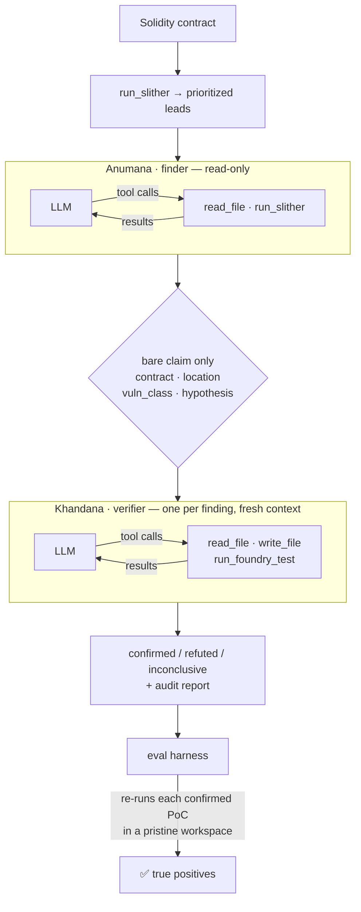

<div align="center">

# Pramana

**A multi-agent smart-contract auditor that proves every vulnerability with an executable exploit.**

No proof-of-concept, no finding. Provider-neutral across Claude, GPT, and Kimi, and measured by an eval harness from day one.

[](https://github.com/divyangchauhan/Pramana/actions/workflows/ci.yml)


</div>

---

Most LLM "audit" tools hand you a wall of plausible-sounding findings and leave you to sort the real bugs from the hallucinations. Pramana takes the opposite stance:

> **A finding is real only when a proof-of-concept exploit executes.**
> For every vulnerability it hypothesises, Pramana writes a [Foundry](https://getfoundry.sh) test that triggers the exploit and runs it. If the test doesn't pass, the finding doesn't ship. Its false-positive rate isn't a vibe — it's whether a PoC executes.

That single design choice — *executable proof over model confidence* — is the line between a demo and something you'd trust. Everything else in the project exists to make that idea reproducible and measurable.

**Pramāṇa** (प्रमाण) is Sanskrit for *"a valid means of knowledge / proof"* — a finding counts as knowledge only once it has been proven.

---

## Results

The headline metric is **true-positive findings confirmed with an executable PoC** — a finding the harness *independently re-runs and watches pass* in a clean workspace, matched to a known real vulnerability.

Full corpus, live with `claude-opus-4-8` on the two-agent pipeline, **repeated 3× — identical every run**:

| Fixture | Vulnerability class(es) | Known bugs | Proven with PoC | True positives |
|---|---|:---:|:---:|:---:|
| `reentrancy-vault` | reentrancy | 1 | ✅ | 1 |
| `unprotected-owner` | access-control | 1 | ✅ | 1 |
| `tx-origin-wallet` | tx-origin | 1 | ✅ | 1 |
| `unchecked-overflow-token` | integer-overflow | 1 | ✅ | 1 |
| `bank-multi` | reentrancy **+** access-control | 2 | ✅ ✅ | 2 |
| `reentrancy-vault-patched` | *none — negative control* | 0 | — | 0 **(0 false positives)** |

**6 / 6 true positives · recall 1.00 · precision 1.00 · 0 false positives on the negative control.** Every finding came with a Foundry exploit that the harness re-ran, from scratch, against the untouched target contract — including the composite `bank-multi`, where both distinct bugs were found and proven independently.

The negative control is the result worth dwelling on. Handed a contract that *looks* exactly like the DAO reentrancy fixture, the pipeline reports nothing — the finder reads the ordering, sees the effect applied before the interaction, and proposes no candidate at all, so no verifier is ever invoked.

The single-agent Phase 0 run reached the same verdict by a more legible route: it wrote a reentrancy exploit, ran it, and **watched it fail**.

> `withdraw()` zeroes the balance (effect) **before** the external call (interaction). A reentrant call finds a zero balance and reverts. […] The test PASSES demonstrating the exploit does NOT work.
> — [`baselines/phase-0/reports/reentrancy-vault-patched.md`](baselines/phase-0/reports/reentrancy-vault-patched.md)

Either way it is the difference between reasoning about code and pattern-matching its shape — and it is only visible *because* the corpus contains something that must not be reported. Worth noting honestly: the split makes the *clean-contract* report thinner, since a claim filtered out at the proposal stage leaves no record of what was checked. That is a deliverable-quality gap no current metric captures, and a job for the Phase 2 reporter.

> **Measurement caveat.** These three runs predate a corpus change. Every fixture's source comments used to explain its own bug (`BUG: tx.origin authentication is phishable`), which the agent reads — so they partly measured reading comprehension. Those comments have been [removed](baselines/#the-corpus-changed); the contracts are otherwise untouched and all six reference exploits still pass. Re-measurement on the hint-free corpus stopped after one clean run when API credits ran out: it held **6 / 6 with 0 false positives**, but one run is not a baseline. See [`baselines/`](baselines/).

📊 **[Full baseline record →](baselines/phase-1/)** — all 3 runs, per-fixture stability, pinned commit and config, and the regression check against [Phase 0](baselines/phase-0/). The agent's own audit reports for every fixture are committed alongside it.

An offline `--self-check` reproduces the entire scoring pipeline (workspace build → `forge test` → class match → count) with **no API key required**.

### Does the verifier ever actually disagree?

In every recorded corpus run, *every* candidate the finder proposed was confirmed — zero refuted. That is consistent with a well-calibrated finder **or** a verifier that rubber-stamps whatever it is handed, and the corpus eval cannot separate them, because the finder never hands the verifier a bad claim.

So `pramana.eval.refutation` puts hand-written claims to the verifier directly, bypassing the finder — in both directions, since a verifier that refuted *everything* would sail through a refutation-only check while being equally useless:

```
probe                        expected       kimi-k3    gpt-5.5
true-claim-control           confirmed      confirmed  confirmed
false-claim-patched-twin     not confirmed  refuted    refuted
false-claim-wrong-mechanism  not confirmed  refuted    refuted
```

It discriminates on both labs. On the patched twin `kimi-k3` spent two forge runs *attempting* the exploit before refuting it — and in a real corpus run it refuted a `missing-zero-check` claim its own finder had proposed. The zero-refutation record reflects a calibrated finder, not a rubber stamp.

### What the eval caught that recall could not

Every architectural change is checked against the previous phase's recorded baseline, as a floor and a ceiling rather than an average — a lucky run must not mask a bad one:

```
$ uv run python -m pramana.eval.baseline --runs runs/*.json \
      --out-dir baselines/phase-1 --against baselines/phase-0/baseline.json

✅ No regression
- True positives:                floor 6 vs baseline floor 6      — gate held
- Negative-control false positives:  worst 0 vs baseline ceiling 0  — gate held
- Unmatched confirmed findings:      worst 0 vs baseline ceiling 0  — gate held
```

That third line exists because of a bug the first two missed. Splitting the pipeline held 6/6 true positives and 0 negative-control false positives — a clean pass — while quietly reporting the `tx.origin` bug **twice**: once as `tx-origin`, once as `access-control`, with two PoCs demonstrating the same phishing attack. The duplicate matched no *unclaimed* known bug, so it disappeared from every number being watched.

It is a direct consequence of context isolation: each verifier sees exactly one claim and cannot know another claim is the same bug. The fix was at the finder (one finding per distinct root cause), but the lesson was the metric — **recall is structurally blind to duplicates**, so a pipeline can score 6/6 while flooding its report. `unmatched_confirmed_findings` now counts them and gates them.

---

## How it works



A single audit, start to finish:

1. **Ground.** [Slither](https://github.com/crytic/slither) runs once and its detector hits seed the finder — *leads to investigate, never findings on their own.*
2. **Investigate.** The finder reads the actual Solidity (`read_file`), traces the flow, and proposes falsifiable exploit hypotheses grounded in code it actually inspected. It has no ability to write or execute anything.
3. **Isolate.** Each hypothesis is passed to a separate verifier as a **bare claim** — contract, location, class, hypothesis. The finder's notes and severity guess are withheld.
4. **Disprove.** The verifier's default assumption is that the claim is *false*. It writes a Foundry PoC (`write_file`) and runs it (`run_foundry_test`); only a passing, assertion-backed test flips the verdict to `confirmed`. Otherwise it returns `refuted` or `inconclusive`.
5. **Score.** The harness rebuilds a fresh workspace with the *pristine* target, copies in only the agent's PoC, and re-runs it — so a finding counts only if the exploit truly executes.

**Why the split matters.** The isolation is structural, not prompted: each verification is its own `run_agent` call with a physically separate `messages` list, seeded from a whitelist (`contracts.bare_claim`). There is no channel through which the finder's confidence can reach the verifier — and because the seed is a whitelist, a field added to `Finding` later cannot silently start leaking. Tool scope enforces the same boundary: the finder *cannot* prove its own hypothesis, because it has no `write_file`.

Here's a real audit (`--verbose`), including the verifier debugging its own PoC:

```
[finder]    read_file        src/EtherStore.sol
[finder]    read_file        src/EtherStore.sol      # traces withdraw() call order
[finder]    (final JSON)     F-001 · reentrancy · "external call precedes state update"
                             ↓  bare claim only — notes and severity guess withheld
[verifier]  read_file        src/EtherStore.sol      # verifies the claim against the code
[verifier]  write_file       test/F-001.t.sol        # first PoC attempt
[verifier]  run_foundry_test                         # ❌ fails: ETH-seeding bug in the test
[verifier]  write_file       test/F-001.t.sol        # self-corrected
[verifier]  run_foundry_test                         # ✅ passes: vault drained 6→0
[verifier]  (final JSON)     confirmed · high · PoC test/F-001.t.sol
```

---

## Why the design holds up

Three ideas do the heavy lifting — each is a deliberate engineering choice, not an accident of the prototype:

- **Executable verification.** Ground truth is `forge test`, not the model's self-assessment. The harness re-runs each PoC against the *original* contract in an isolated workspace, so the agent can't fake a pass by editing the target. `inconclusive` verdicts and non-passing PoCs never count.
- **Eval-first, not eval-later.** The measurement harness ships in the same slice as the pipeline. Every run produces a reproducible true-positive count plus supporting diagnostics (candidate volume, precision before/after verification, recall) — the instrument for answering *"which model, which prompt, which config actually performs?"* empirically.
- **Provider-neutral core.** The agent loop never imports a lab SDK; it speaks one canonical message/tool format. Swapping Claude ↔ GPT ↔ Kimi is a config change, and adding a lab is one adapter file. This is what lets the eval sweep models instead of betting on one.

---

## The corpus

Five self-contained fixtures, each modeled on a landmark real-world exploit, with a labeled known-bug set and a reference PoC:

| Fixture | Class | Modeled on |
|---|---|---|
| `reentrancy-vault` | reentrancy | The DAO (2016) |
| `unprotected-owner` | access-control | Parity multisig unprotected initializer (2017) |
| `tx-origin-wallet` | tx-origin (SWC-115) | `tx.origin` phishing |
| `unchecked-overflow-token` | integer-overflow | BeautyChain (BEC) `batchOverflow` (2018) |
| `bank-multi` | reentrancy **+** access-control | composite two-bug contract — exercises 1:1 matching |

Each `pramana/eval/datasets/<name>/` holds the vulnerable source (`src/`), a `fixture.json` label set, and a `reference/` exploit PoC that validates the grader offline.

**No tells.** Target sources carry only the comments a developer who *didn't know about the bug* would have written — they describe intent, not defects. A fixture that documents its own vulnerability measures reading comprehension instead of discovery, so tests reject bug-naming words in target comments, and every run records a corpus fingerprint: results from different corpora are never compared.

**Negative control.** Recall alone can be gamed by a model that reports everything, so the corpus also ships `reentrancy-vault-patched` — an otherwise identical twin of `reentrancy-vault` whose `withdraw()` applies the effect before the interaction. It declares **zero** known bugs, so every confirmed finding against it is unambiguously a false positive. Its `reference/` holds control tests rather than an exploit, asserting both that the drain now reverts *and* that honest withdrawals still succeed — a degenerate always-revert "fix" would otherwise pass as safe. CI additionally replays the real exploit against the patched twin and requires it to fail, so the control cannot silently rot.

Scaling to public benchmarks (Code4rena / Sherlock / DeFiHackLabs / EVMbench) and a full paired-patch set is on the roadmap.

---

## Quickstart

Requires [`uv`](https://docs.astral.sh/uv/), plus [`forge`](https://getfoundry.sh) (Foundry) and [`slither`](https://github.com/crytic/slither) on `PATH`.

```bash
uv sync                                                       # Python deps
(cd pramana/eval/foundry_template && forge soldeer install)   # restore forge-std
```

`forge-std` is a pinned [Soldeer](https://soldeer.xyz) dependency (`foundry.toml` + `soldeer.lock`) — fetched, not vendored; the harness prints the exact restore command if it's missing.

**Offline self-check** — no API key; grades the reference PoCs to prove the scoring machinery end to end:

```bash
uv run python -m pramana.eval.harness --self-check
```

```
fixture                    cfg                    cand  ref conf  poc+  TP  recall
----------------------------------------------------------------------------------
bank-multi                 reference-poc             2    0    2     2   2    1.00
reentrancy-vault           reference-poc             1    0    1     1   1    1.00
reentrancy-vault-patched   reference-poc             0    0    0     0   0       -
tx-origin-wallet           reference-poc             1    0    1     1   1    1.00
unchecked-overflow-token   reference-poc             1    0    1     1   1    1.00
unprotected-owner          reference-poc             1    0    1     1   1    1.00
----------------------------------------------------------------------------------
HEADLINE — true-positive findings confirmed with executable PoCs: 6 / 6 known bugs
NEGATIVE CONTROLS (1) — false positives: 0 confirmed, 0 with a passing PoC
```

A `recall` of `-` marks a negative control: it has no known bugs, so recall is undefined and the number that matters is its false-positive count.

**Live agent run** — drop your key in `.env` (the app auto-loads it and refuses to start if the selected provider's credential is missing):

```bash
cp .env.example .env         # fill in ANTHROPIC_API_KEY (or OPENAI / MOONSHOT)
uv run python -m pramana.eval.harness --provider anthropic
```

`--pipeline phase1` (finder → isolated verifier) is the default. Pass `--pipeline phase0` to run the original single-agent slice — both stay runnable so the architectural change can be *measured*, not asserted. `ref` in the table counts claims the verifier actively refuted.

**Capture a baseline** — repeat the run, then fold the results into a committed regression record (the pipeline is nondeterministic, so a single run is a point estimate, not a baseline):

```bash
for i in 1 2 3; do
  uv run python -m pramana.eval.harness --provider anthropic \
      --json runs/run-$i.json --report-dir runs/reports-$i
done
uv run python -m pramana.eval.baseline --runs runs/run-*.json \
    --out-dir baselines/phase-0 --label "Phase 0"
```

<details>
<summary>More options</summary>

```bash
# other providers (pass a valid model id)
uv run python -m pramana.eval.harness --provider openai --model <model-id>
uv run python -m pramana.eval.harness --provider kimi   --model <kimi-k3-id>

# handy flags
--fixtures reentrancy-vault tx-origin-wallet   # restrict the set
--json results.json                            # full per-finding results
--report-dir ./reports                         # write a per-fixture audit report.md
--verbose                                      # stream tool calls to stderr
--work-dir ./runs                              # keep workspaces (agent PoCs) to inspect
--forge-retries 3                              # retries for transient forge/anvil flakiness
```

</details>

---

## Providers

The core depends only on the canonical types in `providers/base.py`; each adapter is the sole file that touches a vendor SDK.

| Provider | Adapter | Notes |
|---|---|---|
| **Anthropic** | `providers/anthropic.py` | Messages API via streaming (safe for large `max_tokens`); default `claude-opus-4-8`. No `temperature`/`thinking` config. |
| **OpenAI** | `providers/openai.py` | Chat Completions + function calling; `max_completion_tokens`; no `temperature` (reasoning-model friendly). |
| **Kimi / Moonshot** | `providers/kimi.py` | Kimi K3 via Moonshot's OpenAI-compatible API — reuses the OpenAI translation, swapping only the endpoint (`MOONSHOT_API_KEY`) and the legacy `max_tokens` param. |

Each adapter validates its model at startup and never silently falls back to another provider — audit results and costs stay reproducible.

---

## Layout

```
pramana/
├── providers/          # canonical adapter boundary (base) + anthropic / openai / kimi
├── agents/             # run_agent (bounded, isolated loop) + finder / verifier prompts & tool scopes
├── tools/              # sandboxed read_file / write_file / run_slither / run_foundry_test
├── contracts.py        # Pydantic Finding / Verdict / Phase0Output + boundary parsing
├── pipeline.py         # the orchestrator — audit_phase0 / audit_phase1
├── config.py           # per-role provider/model config, pinned per run
├── env.py              # .env auto-load + startup credential validation
└── eval/
    ├── datasets/       # the real-world corpus (5 vulnerable fixtures / 6 known bugs + 1 negative control)
    ├── foundry_template/ # foundry.toml + soldeer.lock (forge-std pinned)
    ├── workspace.py    # per-run Foundry workspaces
    ├── harness.py      # runs audit() over fixtures, counts true positives
    ├── baseline.py     # folds repeated runs into a baseline; gates later phases
    └── refutation.py   # puts hand-written claims to the verifier, bypassing the finder
baselines/              # recorded baselines + the agent's audit reports
baselines/phase-0/      # the recorded Phase 0 baseline + the agent's audit reports
tests/                  # 124 offline tests (parsing, grading, isolation, tool scope, refutation probe, corpus integrity)
.github/workflows/ci.yml  # ruff + pytest + self-check on every push
docs/design.md          # full system design & staged build plan
```

---

## Quality

```bash
uv run pytest                      # 124 offline tests, no network/keys
uv run ruff check pramana tests    # lint
uv run pyright pramana tests       # type check (clean)
```

Tests cover boundary JSON parsing, vulnerability-class matching (including multi-bug 1:1 matching), the grading paths (a non-passing PoC or wrong class never counts), the Foundry runner's transient-failure retries, the canonical↔provider wire translation for all three labs, env validation, baseline aggregation over disagreeing runs, and the negative control's own integrity — including replaying the real exploit against the patched twin to prove it fails. CI runs the full suite plus the offline self-check on every push ([`.github/workflows/ci.yml`](.github/workflows/ci.yml)).

---

## Roadmap

Pramana is built as a **vertical slice first**, deepening before it widens — every phase is a refactor of a working, demoable system, never a rewrite. Full plan in [`docs/design.md`](docs/design.md).

- **Phase 0 — Vertical slice** ✅ — single provider-neutral agent (find → prove → report), the eval harness, and the real-world corpus. [Baseline](baselines/phase-0/).
- **Phase 1 — Split the verifier** ✅ *(current)* — a context-isolated verifier that sees only the bare claim (not the finder's reasoning), so verification can't be biased by the hypothesis. Gated against the [Phase 0 baseline](baselines/phase-0/) and recorded as its own [Phase 1 baseline](baselines/phase-1/).
- **Phase 2 — Add the reporter + routing** — a third agent that writes the deliverable (and, seeing every verdict at once, is the natural place to catch cross-finding duplicates); per-role model routing swept by the harness; Slither/compile caching.
- **Phase 3 — Scale & harden** — public benchmarks, a full paired vulnerable/patched set, structured observability, and cost-per-role reporting.

The three agents have fixed identities — **Anumana** (finder / inference), **Khandana** (verifier / refutation), **Nirnaya** (reporter / conclusion) — the three *pramāṇas* by which a finding becomes proven knowledge.

---

<div align="center">
<sub>Built to demonstrate agentic LLM systems, evaluation rigor, and smart-contract security — end to end.</sub>
</div>
