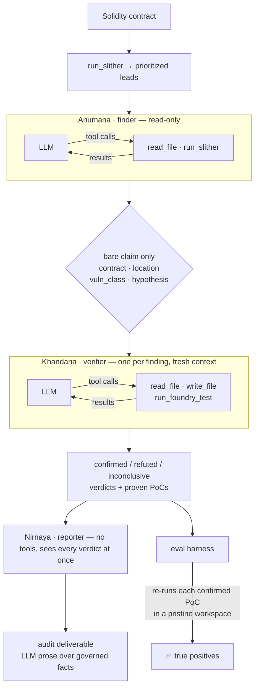

<div align="center">

# Pramana

**A multi-agent smart-contract auditor that proves every vulnerability with an executable exploit.**

No proof-of-concept, no finding. Provider-neutral across Claude, GPT, and Kimi, and measured by an eval harness from day one.

[](https://github.com/divyangchauhan/Pramana/actions/workflows/ci.yml)


</div>

---

Most LLM "audit" tools hand you a wall of plausible-sounding findings and leave you to sort the real bugs from the hallucinations. Pramana takes the opposite stance:

> **A finding is real only when a proof-of-concept exploit executes.**
> For every vulnerability it hypothesises, Pramana writes a [Foundry](https://getfoundry.sh) test that triggers the exploit and runs it. If the test doesn't pass, the finding doesn't ship. Its false-positive rate isn't a vibe — it's whether a PoC executes.

That single design choice — *executable proof over model confidence* — is the line between a demo and something you'd trust. Everything else in the project exists to make that idea reproducible and measurable.

**Pramāṇa** (प्रमाण) is Sanskrit for *"a valid means of knowledge / proof"* — a finding counts as knowledge only once it has been proven.

---

## Results

The headline metric is **true-positive findings confirmed with an executable PoC** — a finding the harness *independently re-runs and watches pass* in a clean workspace, matched to a known real vulnerability.

### The corpus is real, and provable without an API key

Every one of the 14 labeled bugs ships with a reference exploit the harness executes in a pristine workspace. `--self-check` runs the entire scoring pipeline — workspace build → `forge test` → class match → count — with **no key and no network**:

```
HEADLINE — true-positive findings confirmed with executable PoCs: 14 / 14 known bugs
NEGATIVE CONTROLS (1) — false positives: 0 confirmed, 0 with a passing PoC
```

That is the corpus proving itself, not the agent. It means a failure in a live run is the pipeline's, never a broken fixture.

### A four-model sweep

Because the core is provider-neutral, the same pipeline runs unmodified across labs — the comparison is apples-to-apples by construction. This is `phase1` (finder → isolated verifier) at `effort=medium`, three runs per model, graded against the current **14-bug** corpus (`8693741ffa57`):

| Model | Access | True positives / 14 (3 runs) | Control FPs | |
|---|---|:---:|:---:|---|
| `claude-opus-4-8` | first-party | 11 · 11 · 11 | 0 | gate reference — stable floor |
| `gpt-5.5` | subscription proxy | 11 · 11 · 11 | 0 | matches Opus at zero marginal cost |
| `gpt-5.6-terra` | subscription proxy | 12 · 12 · 10 | 0 | run-3 recall dip |
| **`kimi-k3`** 🏆 | first-party | **13 · 11 · 13** | 0 | **highest peaks; found every uncatalogued bug** |
| `claude-fable-5` | first-party | — | — | *refused the task — see below* |

**Winner: `kimi-k3`, on discovery power** — the axis that matters for an audit tool. It posted the highest true-positive peaks (13/14) and was the only model to surface all three bugs the corpus itself was missing (next section). `gpt-5.5` is the best *value* — it matches the Opus floor at zero marginal cost on a flat subscription — but finds fewer distinct bugs. Opus is the **gate reference**: a fixed regression yardstick chosen for reproducibility (first-party, stable), used to catch *code* regressions between phases. Being the yardstick is not the same as being the best model, and here it isn't.

**One model refused — and that is a result, not a gap.** `claude-fable-5` returned `stop_reason: "refusal"` with empty content on every fixture — a model-level safety decline of the vulnerability-finder task, not a bug or a misconfiguration (the identical prompt runs cleanly on Opus, confirmed by capturing the raw response). A provider-neutral harness turns that difference from an anecdote into a measurement: it shows up as a row, priced and logged, beside the models that ran.

Every run and baseline records a `corpus_fingerprint` and a `grader_version`, so comparing across corpora or grading rules reports *"not comparable"* rather than a misleading number. See [`baselines/`](baselines/).

#### The sweep audited the corpus

The sweep's most useful finding was about the *corpus*, not the models. Exploits the grader marked "unmatched confirmed" — real, PoC-passing bugs with no label to match — turned out to be genuine defects the corpus never catalogued, not hallucinations (the negative control held at **0** false positives across all runs). Three were canonized, each with an executable reference PoC, taking the corpus from **11 → 14** known bugs (`007869fd6cad` → `8693741ffa57`, grader unchanged):

| New bug | Fixture | Found by |
|---|---|---|
| `zero-signer` | signature-replay-vault | every model, every run |
| `fixed-gas-transfer` (transfer-DoS) | signature-replay-vault | kimi-k3 only |
| `missing-zero-check` (zero-addr burn) | unchecked-send-payouts | kimi-k3 + gpt-5.6-terra |

The new baseline was produced by **re-grading the saved runs, without re-invoking a single model**: a PoC's pass/fail is invariant to a corpus change — only *which* known bug it matches can differ — so each finding was rescored through the real grading path from its recorded verdict and PoC result. An eval that can find bugs in its own answer key is an eval worth trusting.

### What a run costs

Every run records tokens, model latency and money **per role**, priced from a
dated, versioned table (`pramana/cost.py`). A model missing from that table
reports `null`, never `$0` — an unpriced model costing nothing would win every
cost comparison it entered.

```
COST (price table 2026-07-22)
  finder    anthropic:claude-opus-4-8    in    8,568  out     553    3 calls     12.4s     $0.0567
  verifier  anthropic:claude-opus-4-8    in   11,100  out   1,038    4 calls     21.8s     $0.0814
  TOTAL                                                                                     $0.1381
```

Per role, because "which slot is the money going to" is the question routing
has to answer — and the first measurement already contradicts the usual guess
that the finder is the expensive one. **The verifier costs more** (59% of the
bill here): it writes code, runs it, reads failures and retries, while the
finder reads and proposes once.

**Recall is deliberately below 100%, and the models now genuinely disagree — which is the point.** Opus holds a rock-steady 11/14 while kimi peaks at 13/14, and the gap is *specific* bugs — the transfer-DoS, the zero-address burn — that one model proposes and another never does. A corpus small enough that every model aces it cannot rank anything; fourteen bugs across eleven classes can.

The negative control is the result worth dwelling on. Handed a contract that *looks* exactly like the DAO reentrancy fixture, the pipeline reports nothing — the finder reads the ordering, sees the effect applied before the interaction, and proposes no candidate at all, so no verifier is ever invoked.

The single-agent Phase 0 run reached the same verdict by a more legible route: it wrote a reentrancy exploit, ran it, and **watched it fail**.

> `withdraw()` zeroes the balance (effect) **before** the external call (interaction). A reentrant call finds a zero balance and reverts. […] The test PASSES demonstrating the exploit does NOT work.
> — [`baselines/phase-0/reports/reentrancy-vault-patched.md`](baselines/phase-0/reports/reentrancy-vault-patched.md)

Either way it is the difference between reasoning about code and pattern-matching its shape — and it is only visible *because* the corpus contains something that must not be reported. Worth noting honestly: the split makes the *clean-contract* report thinner, since a claim filtered out at the proposal stage leaves no record of what was checked — a deliverable-quality gap no current metric captures. The [Phase 2 reporter](#how-it-works) (Nirnaya) is the stage that owns deliverable quality, though closing this particular gap fully would mean recording what the finder ruled out, which it does not yet do.

📊 **[Baseline records →](baselines/)** — every run, per-fixture stability, pinned commit, config and corpus, plus the agent's own audit reports.

An offline `--self-check` reproduces the entire scoring pipeline (workspace build → `forge test` → class match → count) with **no API key required**.

### Does the verifier ever actually disagree?

In every recorded corpus run, *every* candidate the finder proposed was confirmed — zero refuted. That is consistent with a well-calibrated finder **or** a verifier that rubber-stamps whatever it is handed, and the corpus eval cannot separate them, because the finder never hands the verifier a bad claim.

So `pramana.eval.refutation` puts hand-written claims to the verifier directly, bypassing the finder — in both directions, since a verifier that refuted *everything* would sail through a refutation-only check while being equally useless:

```
probe                        expected       kimi-k3    gpt-5.5
true-claim-control           confirmed      confirmed  confirmed
false-claim-patched-twin     not confirmed  refuted    refuted
false-claim-wrong-mechanism  not confirmed  refuted    refuted
```

It discriminates on both labs. On the patched twin `kimi-k3` spent two forge runs *attempting* the exploit before refuting it — and in a real corpus run it refuted a `missing-zero-check` claim its own finder had proposed. The zero-refutation record reflects a calibrated finder, not a rubber stamp.

### What the eval caught that recall could not

Every architectural change is checked against the previous phase's recorded baseline, as a floor and a ceiling rather than an average — a lucky run must not mask a bad one:

```
$ uv run python -m pramana.eval.baseline --runs runs/*.json \
      --out-dir baselines/phase-1 --against baselines/phase-0/baseline.json

✅ No regression
- True positives:                floor 6 vs baseline floor 6      — gate held
- Negative-control false positives:  worst 0 vs baseline ceiling 0  — gate held
- Unmatched confirmed findings:      worst 0 vs baseline ceiling 0  — gate held
```

That third line exists because of a bug the first two missed. Splitting the pipeline held 6/6 true positives and 0 negative-control false positives — a clean pass — while quietly reporting the `tx.origin` bug **twice**: once as `tx-origin`, once as `access-control`, with two PoCs demonstrating the same phishing attack. The duplicate matched no *unclaimed* known bug, so it disappeared from every number being watched.

It is a direct consequence of context isolation: each verifier sees exactly one claim and cannot know another claim is the same bug. The fix was at the finder (one finding per distinct root cause), but the lesson was the metric — **recall is structurally blind to duplicates**, so a pipeline can score 6/6 while flooding its report. `unmatched_confirmed_findings` now counts them and gates them.

---

## How it works



A single audit, start to finish:

1. **Ground.** [Slither](https://github.com/crytic/slither) runs once and its detector hits seed the finder — *leads to investigate, never findings on their own.*
2. **Investigate.** The finder reads the actual Solidity (`read_file`), traces the flow, and proposes falsifiable exploit hypotheses grounded in code it actually inspected. It has no ability to write or execute anything.
3. **Isolate.** Each hypothesis is passed to a separate verifier as a **bare claim** — contract, location, class, hypothesis. The finder's notes and severity guess are withheld.
4. **Disprove.** The verifier's default assumption is that the claim is *false*. It writes a Foundry PoC (`write_file`) and runs it (`run_foundry_test`); only a passing, assertion-backed test flips the verdict to `confirmed`. Otherwise it returns `refuted` or `inconclusive`.
5. **Report** *(Phase 2, Nirnaya)*. A third `run_agent` role — no tools, the cheap synthesis slot — turns the settled verdicts into the client deliverable. It is the only stage that sees every finding at once, so it is where cross-finding duplicates are caught (each verifier saw one claim in isolation). It writes the prose; **severity, PoC path, verdict and counts come from the verdicts, not the model** — the same [governed-in-code](#why-the-design-holds-up) discipline as the severity cap — so a reporter can enrich a finding but cannot move a number or drop one, and a report it can't produce falls back to a deterministic render.
6. **Score.** The harness rebuilds a fresh workspace with the *pristine* target, copies in only the agent's PoC, and re-runs it — so a finding counts only if the exploit truly executes.

**Why the split matters.** The isolation is structural, not prompted: each verification is its own `run_agent` call with a physically separate `messages` list, seeded from a whitelist (`contracts.bare_claim`). There is no channel through which the finder's confidence can reach the verifier — and because the seed is a whitelist, a field added to `Finding` later cannot silently start leaking. Tool scope enforces the same boundary: the finder *cannot* prove its own hypothesis, because it has no `write_file`.

Here's a real audit (`--verbose`), including the verifier debugging its own PoC:

```
[finder]    read_file        src/EtherStore.sol
[finder]    read_file        src/EtherStore.sol      # traces withdraw() call order
[finder]    (final JSON)     F-001 · reentrancy · "external call precedes state update"
                             ↓  bare claim only — notes and severity guess withheld
[verifier]  read_file        src/EtherStore.sol      # verifies the claim against the code
[verifier]  write_file       test/F-001.t.sol        # first PoC attempt
[verifier]  run_foundry_test                         # ❌ fails: ETH-seeding bug in the test
[verifier]  write_file       test/F-001.t.sol        # self-corrected
[verifier]  run_foundry_test                         # ✅ passes: vault drained 6→0
[verifier]  (final JSON)     confirmed · high · PoC test/F-001.t.sol
```

---

## Why the design holds up

Four ideas do the heavy lifting — each is a deliberate engineering choice, not an accident of the prototype:

- **Executable verification.** Ground truth is `forge test`, not the model's self-assessment. The harness re-runs each PoC against the *original* contract in an isolated workspace, so the agent can't fake a pass by editing the target. `inconclusive` verdicts and non-passing PoCs never count.
- **Eval-first, not eval-later.** The measurement harness ships in the same slice as the pipeline. Every run produces a reproducible true-positive count plus supporting diagnostics (candidate volume, precision before/after verification, recall) — the instrument for answering *"which model, which prompt, which config actually performs?"* empirically.
- **Provider-neutral core.** The agent loop never imports a lab SDK; it speaks one canonical message/tool format. Swapping Claude ↔ GPT ↔ Kimi is a config change, and adding a lab is one adapter file. This is what lets the eval sweep models instead of betting on one.
- **Governed in code, not prompt.** The facts a report is judged on are enforced in Python, never left to a model to honor. A bug provable only by *deploying the contract badly yourself* (e.g. `signer = address(0)`) is real but not attacker-reachable, and must not outrank a live exploit: the verifier declares `deployment_contingent` and `Verdict.capped()` enforces the ceiling in Python — because the sweep compares models directly, and a rule left to the prompt would be read differently by each one, distorting the very comparison it exists to make. The reporter follows the same discipline: it authors prose, but severity, PoC path, verdict and counts are woven in from the verdicts by the renderer, so a reporter can enrich a finding but can never move a number or drop one.

---

## The corpus

Nine self-contained vulnerable fixtures holding **14 known bugs across eleven vulnerability classes**, each bug with a labeled entry and a reference exploit that the harness re-runs offline:

| Fixture | Class(es) | Modeled on |
|---|---|---|
| `reentrancy-vault` | reentrancy | The DAO (2016) |
| `unprotected-owner` | access-control | Parity multisig unprotected initializer (2017) |
| `tx-origin-wallet` | tx-origin | SWC-115 `tx.origin` phishing |
| `unchecked-overflow-token` | integer-overflow | BeautyChain (BEC) `batchOverflow` (2018) |
| `unchecked-send-payouts` | unchecked-call **+** missing-zero-check | SWC-104 — King of the Ether (2016) |
| `delegatecall-module` | delegatecall | SWC-112 — Parity multisig library kill (2017) |
| `weak-randomness-lottery` | weak-randomness | SWC-120 — chain-attribute RNG |
| `signature-replay-vault` | signature-replay **+** zero-signer **+** fixed-gas-transfer | SWC-121 — missing nonce |
| `bank-multi` | reentrancy **+** access-control **+** missing-zero-check | composite three-bug contract — exercises 1:1 matching |

Each `pramana/eval/datasets/<name>/` holds the vulnerable source (`src/`), a `fixture.json` label set, and a `reference/` exploit PoC that validates the grader offline. Three of these bugs — the two extras on `signature-replay-vault` and the `missing-zero-check` on `unchecked-send-payouts` — were [added *because the sweep found them*](#the-sweep-audited-the-corpus): the eval discovered real defects its own answer key was missing.

**The label is the weakest link in the metric.** Two of the three true-positive conditions are executable facts — the agent said "confirmed", and the harness re-ran the PoC and watched it pass. The third is string equality on a free-text vulnerability class, and models name one bug many ways: the same proven delegatecall storage collision arrived as `unrestricted-delegatecall`, `arbitrary-delegatecall`, `controlled-delegatecall` and plain `access-control` across six runs. The last one scored **zero** on recall *and* both precision axes — for a finding whose exploit drained the vault in front of the grader. Vocabulary is a per-model habit, so a grader sensitive to it partly ranks naming style instead of capability, which is fatal to a cross-model sweep.

Two mechanisms fix it, answering different questions.

The first is **how a label resolves when it names more than one class**. Real labels are compounds — `unprotected-delegatecall`, `unchecked-zero-address`, `owner-signature-replay` — and the grader originally took the first canonical class whose keyword appeared, walking an ordered map. That made precedence a function of typing position: `access-control` sat near the top holding the most generic words in the vocabulary (`auth`, `owner`, `unprotected`), so it quietly captured labels belonging to six other classes, while `signature-replay`, added last, could be outranked by all eight above it. Resolution now goes by specificity instead — a word that *names* a class beats one that merely *qualifies* it, then longest match wins — which fixes 15 of 47 plausible labels and, checked against all 202 vulnerability labels ever recorded in this repo's runs, rescores none of them.

The second is **per-bug aliases**, for names that are ambiguous no matter how carefully you resolve them: a delegatecall storage collision genuinely *is* an access-control break, mechanism versus consequence. Such a bug declares the alternatives itself (`"accepts": ["access-control"]` in `fixture.json`), and a match on a bug's own class always outranks an alias. Widening the shared synonym map instead would merge two classes *everywhere*, so a model that found only an access-control bug could be credited for a delegatecall bug it never saw.

Because grading rules change what a run scores without changing what the agent was asked to do, they are pinned by a `grader_version` alongside the corpus fingerprint — two identifiers for two questions: *is this the same corpus?* and *was it graded the same way?*

**No tells.** Target sources carry only the comments a developer who *didn't know about the bug* would have written — they describe intent, not defects. A fixture that documents its own vulnerability measures reading comprehension instead of discovery, so tests reject bug-naming words in target comments, and every run records a corpus fingerprint: results from different corpora are never compared.

**Negative control.** Recall alone can be gamed by a model that reports everything, so the corpus also ships `reentrancy-vault-patched` — an otherwise identical twin of `reentrancy-vault` whose `withdraw()` applies the effect before the interaction. It declares **zero** known bugs, so every confirmed finding against it is unambiguously a false positive. Its `reference/` holds control tests rather than an exploit, asserting both that the drain now reverts *and* that honest withdrawals still succeed — a degenerate always-revert "fix" would otherwise pass as safe. CI additionally replays the real exploit against the patched twin and requires it to fail, so the control cannot silently rot.

Scaling to public benchmarks (Code4rena / Sherlock / DeFiHackLabs / EVMbench) and a full paired-patch set is on the roadmap.

---

## Quickstart

Requires [`uv`](https://docs.astral.sh/uv/), plus [`forge`](https://getfoundry.sh) (Foundry) and [`slither`](https://github.com/crytic/slither) on `PATH`.

```bash
uv sync                                                       # Python deps
(cd pramana/eval/foundry_template && forge soldeer install)   # restore forge-std
```

`forge-std` is a pinned [Soldeer](https://soldeer.xyz) dependency (`foundry.toml` + `soldeer.lock`) — fetched, not vendored; the harness prints the exact restore command if it's missing.

**Offline self-check** — no API key; grades the reference PoCs to prove the scoring machinery end to end:

```bash
uv run python -m pramana.eval.harness --self-check
```

```
=== Pramana eval ===
fixture                    cfg                    cand  ref conf  poc+  TP  recall
----------------------------------------------------------------------------------
bank-multi                 reference-poc             3    0    3     3   3    1.00
delegatecall-module        reference-poc             1    0    1     1   1    1.00
reentrancy-vault           reference-poc             1    0    1     1   1    1.00
reentrancy-vault-patched   reference-poc             0    0    0     0   0       -
signature-replay-vault     reference-poc             3    0    3     3   3    1.00
tx-origin-wallet           reference-poc             1    0    1     1   1    1.00
unchecked-overflow-token   reference-poc             1    0    1     1   1    1.00
unchecked-send-payouts     reference-poc             2    0    2     2   2    1.00
unprotected-owner          reference-poc             1    0    1     1   1    1.00
weak-randomness-lottery    reference-poc             1    0    1     1   1    1.00
----------------------------------------------------------------------------------

HEADLINE — true-positive findings confirmed with executable PoCs: 14 / 14 known bugs
NEGATIVE CONTROLS (1) — false positives: 0 confirmed, 0 with a passing PoC
```

A `recall` of `-` marks a negative control: it has no known bugs, so recall is undefined and the number that matters is its false-positive count.

**Live agent run** — drop your key in `.env` (the app auto-loads it and refuses to start if the selected provider's credential is missing):

```bash
cp .env.example .env         # fill in ANTHROPIC_API_KEY (or OPENAI / MOONSHOT)
uv run python -m pramana.eval.harness --provider anthropic
```

`--pipeline phase1` (finder → isolated verifier) is the default. Pass `--pipeline phase0` to run the original single-agent slice — both stay runnable so the architectural change can be *measured*, not asserted. `ref` in the table counts claims the verifier actively refuted.

**Capture a baseline** — repeat the run, then fold the results into a committed regression record (the pipeline is nondeterministic, so a single run is a point estimate, not a baseline):

```bash
for i in 1 2 3; do
  uv run python -m pramana.eval.harness --provider anthropic \
      --json runs/run-$i.json --report-dir runs/reports-$i
done
uv run python -m pramana.eval.baseline --runs runs/run-*.json \
    --out-dir baselines/phase-0 --label "Phase 0"
```

<details>
<summary>More options</summary>

```bash
# other providers (pass a valid model id)
uv run python -m pramana.eval.harness --provider openai --model <model-id>
uv run python -m pramana.eval.harness --provider kimi   --model <kimi-k3-id>

# pipelines and per-role routing
--pipeline phase2                              # add the reporter (Nirnaya) that writes the deliverable
--reporter-model <cheap-model-id>              # route the cheap synthesis slot to a smaller model
--finder-model <id> --verifier-model <id>      # route the two hard roles independently

# handy flags
--fixtures reentrancy-vault tx-origin-wallet   # restrict the set
--json results.json                            # full per-finding results
--report-dir ./reports                         # write a per-fixture audit report.md
--verbose                                      # stream tool calls to stderr
--work-dir ./runs                              # keep workspaces (agent PoCs) to inspect
--forge-retries 3                              # retries for transient forge/anvil flakiness
```

</details>

---

## Providers

The core depends only on the canonical types in `providers/base.py`; each adapter is the sole file that touches a vendor SDK.

| Provider | Adapter | Notes |
|---|---|---|
| **Anthropic** | `providers/anthropic.py` | Messages API via streaming (safe for large `max_tokens`); default `claude-opus-4-8`. Sends `thinking: {type: adaptive}` (Opus 4.8 does not reason without it) + `output_config.effort`; no `temperature` (removed on Opus 4.8). |
| **OpenAI** | `providers/openai.py` | Chat Completions + function calling; `max_completion_tokens` + `reasoning_effort`; no `temperature` (reasoning-model friendly). |
| **Kimi / Moonshot** | `providers/kimi.py` | Kimi K3 via Moonshot's OpenAI-compatible API — reuses the OpenAI translation, swapping only the endpoint (`MOONSHOT_API_KEY`) and the legacy `max_tokens` param. |
| **`anthropic-gateway` / `openai-gateway`** | same adapters | Same wire protocol and model, reached through a subscription-replaying proxy (`ANTHROPIC_BASE_URL` / `OPENAI_BASE_URL`). Billing differs — a flat subscription, not per-token — so these keys are **absent from the price table and report `usd: null`** rather than pricing a run off dollars that were never charged. Each refuses to construct without its `*_BASE_URL`, so a gateway run can never silently reach a first-party endpoint. |

Each adapter validates its model at startup and never silently falls back to another provider — audit results and costs stay reproducible.

---

## Layout

```
pramana/
├── providers/          # canonical adapter boundary (base) + anthropic / openai / kimi
├── agents/             # run_agent (bounded, isolated loop) + finder / verifier / reporter prompts & tool scopes
├── tools/              # sandboxed read_file / write_file / run_slither / run_foundry_test
├── contracts.py        # Pydantic Finding / Verdict / ReporterOutput / Phase0Output + boundary parsing
├── pipeline.py         # the orchestrator — audit_phase0 / audit_phase1 / audit_phase2
├── config.py           # per-role provider/model config, pinned per run
├── env.py              # .env auto-load + startup credential validation
└── eval/
    ├── datasets/       # the corpus (9 vulnerable fixtures / 14 known bugs / 11 classes + 1 negative control)
    ├── foundry_template/ # foundry.toml + soldeer.lock (forge-std pinned)
    ├── workspace.py    # per-run Foundry workspaces
    ├── harness.py      # runs audit() over fixtures, counts true positives
    ├── baseline.py     # folds repeated runs into a baseline; gates later phases
    └── refutation.py   # puts hand-written claims to the verifier, bypassing the finder
baselines/              # recorded baselines + the agent's audit reports
baselines/phase-0/      # the recorded Phase 0 baseline + the agent's audit reports
tests/                  # 294 offline tests (parsing, grading, isolation, tool scope, refusal handling, severity cap, reporter governance, corpus integrity)
.github/workflows/ci.yml  # ruff + pytest + self-check on every push
docs/design.md          # full system design & staged build plan
```

---

## Quality

```bash
uv run pytest                      # 294 offline tests, no network/keys
uv run ruff check pramana tests    # lint
uv run pyright pramana tests       # type check (clean)
```

Tests cover boundary JSON parsing, vulnerability-class matching (including multi-bug 1:1 matching and specificity-based label resolution), the grading paths (a non-passing PoC or wrong class never counts), the deployment-contingent severity cap (a mutation check fails the suite if the cap is removed from the pipeline), the reporter's governance boundary (its prose is woven in, but a reporter cannot move a severity, drop a finding, or invent a count — and an unreadable report falls back to a deterministic render), the Foundry runner's transient-failure retries, the canonical↔provider wire translation for every lab, refusal handling (a model that declines at its safety layer is recorded as a refusal, not a parse error), gateway-vs-first-party pricing (a gateway key may never enter the price table), env validation, baseline aggregation over disagreeing runs, and the negative control's own integrity — including replaying the real exploit against the patched twin to prove it fails. CI runs the full suite plus the offline self-check on every push ([`.github/workflows/ci.yml`](.github/workflows/ci.yml)).

---

## Roadmap

Pramana is built as a **vertical slice first**, deepening before it widens — every phase is a refactor of a working, demoable system, never a rewrite. Full plan in [`docs/design.md`](docs/design.md).

- **Phase 0 — Vertical slice** ✅ — single provider-neutral agent (find → prove → report), the eval harness, and the real-world corpus. [Baseline](baselines/phase-0/).
- **Phase 1 — Split the verifier** ✅ — a context-isolated verifier that sees only the bare claim (not the finder's reasoning), so verification can't be biased by the hypothesis. Gated against the [Phase 0 baseline](baselines/phase-0/) and recorded as the [Phase 1 gate reference](baselines/phase-1-8693741ffa57/).
- **Phase 2 — Routing, governance + the reporter** 🚧 *(current)* — the [four-model sweep](#a-four-model-sweep) (per-role routing, priced per role) and its subscription-proxy gateways; a **deployment-contingent severity cap** so a bug that needs a misconfigured deploy can't outrank an attacker-reachable one; the corpus expansion the sweep surfaced; and the **reporter** agent (Nirnaya) that writes the client deliverable — the third `run_agent` role, and the only stage that sees every verdict at once, so it is where cross-finding duplicates are caught. It authors prose (description, impact, remediation, executive summary, duplicate links); severity, PoC path, verdict and counts stay [governed in code](#why-the-design-holds-up), so a reporter can enrich a finding but never move a number or drop one. Still ahead: Slither/compile caching.
- **Phase 3 — Scale & harden** — public benchmarks (Code4rena / Sherlock / DeFiHackLabs), a full paired vulnerable/patched set, and structured observability.

The three agents have fixed identities — **Anumana** (finder / inference), **Khandana** (verifier / refutation), **Nirnaya** (reporter / conclusion) — the three *pramāṇas* by which a finding becomes proven knowledge.

---

<div align="center">
<sub>Built to demonstrate agentic LLM systems, evaluation rigor, and smart-contract security — end to end.</sub>
</div>
