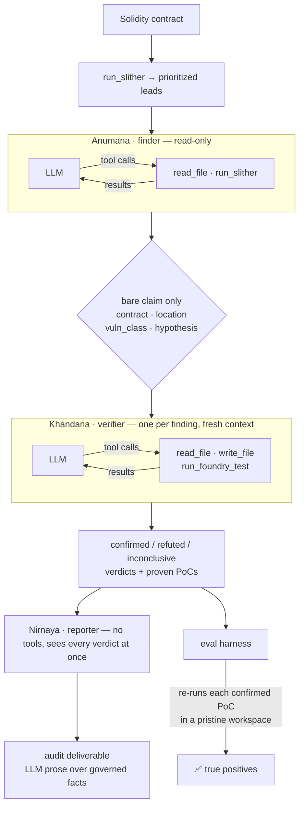

<div align="center">

# Pramana

**A multi-agent smart-contract auditor that proves every vulnerability with an executable exploit.**

No proof-of-concept, no finding. Provider-neutral across Claude, GPT, and Kimi, and measured by an eval harness from day one.

[](https://github.com/divyangchauhan/Pramana/actions/workflows/ci.yml)


</div>

---

Most LLM "audit" tools hand you a wall of plausible-sounding findings and leave you to sort the real bugs from the hallucinations. Pramana takes the opposite stance:

> **A finding is real only when a proof-of-concept exploit executes.**
> For every vulnerability it hypothesises, Pramana writes a [Foundry](https://getfoundry.sh) test that triggers the exploit and runs it. If the test doesn't pass, the finding doesn't ship. Its false-positive rate isn't a vibe — it's whether a PoC executes.

That single choice — *executable proof over model confidence* — is the line between a demo and something you'd trust. Everything else exists to make it reproducible and measurable.

**Pramāṇa** (प्रमाण) is Sanskrit for *"a valid means of knowledge / proof"* — a finding counts as knowledge only once it has been proven.

---

## Results

A **true positive** is a finding whose PoC the harness independently re-runs and watches pass in a clean workspace, matched to a known bug. Everything below is measured, reproducible, and pinned to a corpus fingerprint and grader version.

### The corpus proves itself — offline, no key

All 14 labeled bugs ship with a reference exploit. `--self-check` runs the full scoring pipeline — build workspace → `forge test` → class match → count — with **no key and no network**:

```
HEADLINE — true-positive findings confirmed with executable PoCs: 14 / 14 known bugs
NEGATIVE CONTROLS (1) — false positives: 0 confirmed, 0 with a passing PoC
```

That is the corpus proving itself, not the agent — so a failure in a live run is the pipeline's, never a broken fixture.

### Four models, one unmodified pipeline

Because the core is provider-neutral, the same pipeline runs unmodified across labs — the comparison is apples-to-apples by construction. This is `phase1` (finder → isolated verifier) at `effort=medium`, three runs per model, graded against the 14-bug corpus (`8693741ffa57`):

| Model | Access | True positives / 14 (3 runs) | Control FPs | |
|---|---|:---:|:---:|---|
| `claude-opus-4-8` | first-party | 11 · 11 · 11 | 0 | gate reference — stable floor |
| `gpt-5.5` | subscription proxy | 11 · 11 · 11 | 0 | matches Opus at zero marginal cost |
| `gpt-5.6-terra` | subscription proxy | 12 · 12 · 10 | 0 | run-3 recall dip |
| **`kimi-k3`** 🏆 | first-party | **13 · 11 · 13** | 0 | **highest peaks; found every uncatalogued bug** |
| `claude-fable-5` | first-party | — | — | *refused the task — see below* |

**`kimi-k3` wins on discovery** — the axis that matters for an audit tool. It posted the highest true-positive peaks (13/14) and was the only model to surface all three bugs the corpus itself was missing. `gpt-5.5` is the best *value*: it matches the Opus floor at zero marginal cost on a flat subscription. Opus is the **gate reference** — a fixed, reproducible yardstick (first-party, stable) for catching *code* regressions between phases. Being the yardstick isn't being the best model, and here it isn't. A corpus small enough that every model aces it can't rank anything; 14 bugs across 11 classes can.

**One model refused — and that is a result, not a gap.** `claude-fable-5` returned `stop_reason: "refusal"` with empty content on every fixture — a model-level safety decline of the vulnerability-finder task, not a bug or misconfiguration (the identical prompt runs clean on Opus). A provider-neutral harness turns that from an anecdote into a measurement: it shows up as a row, priced and logged, beside the models that ran.

Every run and baseline records a `corpus_fingerprint` and a `grader_version`, so comparing across corpora or grading rules reports *"not comparable"* rather than a misleading number.

### What a run costs

```
COST (price table 2026-07-22)
  finder    anthropic:claude-opus-4-8    in    8,568  out     553    3 calls     12.4s     $0.0567
  verifier  anthropic:claude-opus-4-8    in   11,100  out   1,038    4 calls     21.8s     $0.0814
  TOTAL                                                                                     $0.1381
```

Per role, because "which slot is the money going to?" is the question routing has to answer — and the first measurement already contradicts the usual guess. **The verifier costs more** (59% here): it writes code, runs it, reads failures and retries, while the finder reads and proposes once. Costs come from a dated, versioned table (`pramana/cost.py`); an unpriced model reports `null`, never `$0` — a free model would win every cost comparison it entered.

### The eval audits itself

Two findings mattered more than any model ranking.

**It found bugs in its own answer key.** Exploits the grader marked "unmatched confirmed" — real, PoC-passing bugs with no label to match — turned out to be genuine defects the corpus never catalogued, not hallucinations (the negative control held at **0** false positives throughout). Three were canonized with executable reference PoCs, taking the corpus **11 → 14** — produced by *re-grading the saved runs, without re-invoking a single model*, since a PoC's pass/fail is invariant to a corpus change. An eval that can find bugs in its own answer key is one worth trusting.

| New bug | Fixture | Found by |
|---|---|---|
| `zero-signer` | signature-replay-vault | every model, every run |
| `fixed-gas-transfer` (transfer-DoS) | signature-replay-vault | kimi-k3 only |
| `missing-zero-check` (zero-addr burn) | unchecked-send-payouts | kimi-k3 + gpt-5.6-terra |

**Recall is structurally blind to duplicates.** Every phase is gated against the previous baseline as a floor *and* a ceiling, so a lucky run can't mask a bad one. Splitting the pipeline scored a clean 6/6 true positives while quietly reporting one `tx.origin` bug **twice** — once as `tx-origin`, once as `access-control`, two PoCs, same phishing attack. It matched no *unclaimed* known bug, so it vanished from every number being watched. Direct consequence of context isolation: each verifier sees one claim and can't know another is the same bug. `unmatched_confirmed_findings` now counts and gates it — and closing it cleanly is exactly what the Phase 2 [reporter](#how-it-works) owns.

**The verifier doesn't rubber-stamp.** In every recorded corpus run, every candidate the finder proposed was confirmed — consistent with a calibrated finder *or* a verifier that rubber-stamps whatever it's handed. `pramana.eval.refutation` settles it by putting hand-written claims to the verifier directly, bypassing the finder, in both directions:

```
probe                        expected       kimi-k3    gpt-5.5
true-claim-control           confirmed      confirmed  confirmed
false-claim-patched-twin     not confirmed  refuted    refuted
false-claim-wrong-mechanism  not confirmed  refuted    refuted
```

It discriminates on both labs. On the patched twin `kimi-k3` spent two forge runs *attempting* the exploit before refuting it — and in a real corpus run it refuted a `missing-zero-check` claim its own finder had proposed. The zero-refutation record reflects a calibrated finder, not a rubber stamp.

📊 **[Baseline records →](baselines/)** — every run, per-fixture stability, pinned commit, config and corpus, plus the agent's own audit reports.

---

## How it works



A single audit, start to finish:

1. **Ground.** [Slither](https://github.com/crytic/slither) runs once and its detector hits seed the finder — *leads to investigate, never findings on their own.*
2. **Investigate.** The finder reads the actual Solidity (`read_file`), traces the flow, and proposes falsifiable exploit hypotheses grounded in code it inspected. It cannot write or execute anything.
3. **Isolate.** Each hypothesis passes to a separate verifier as a **bare claim** — contract, location, class, hypothesis. The finder's notes and severity guess are withheld.
4. **Disprove.** The verifier assumes the claim is *false*. It writes a Foundry PoC (`write_file`) and runs it (`run_foundry_test`); only a passing, assertion-backed test flips the verdict to `confirmed`. Otherwise `refuted` or `inconclusive`.
5. **Report** *(Phase 2, Nirnaya)*. A third `run_agent` role — no tools, the cheap synthesis slot — turns settled verdicts into the client deliverable. It's the only stage that sees every finding at once, so it's where cross-finding duplicates are caught. It writes the prose; **severity, PoC path, verdict and counts come from the verdicts, not the model** — the same [governed-in-code](#why-the-design-holds-up) discipline as the severity cap — so a reporter can enrich a finding but can't move a number or drop one, and a report it can't produce falls back to a deterministic render.
6. **Score.** The harness rebuilds a fresh workspace with the *pristine* target, copies in only the agent's PoC, and re-runs it — a finding counts only if the exploit truly executes.

**Why the split matters.** The isolation is structural, not prompted: each verification is its own `run_agent` call with a physically separate `messages` list, seeded from a whitelist (`contracts.bare_claim`). There is no channel through which the finder's confidence can reach the verifier — and because the seed is a whitelist, a field added to `Finding` later can't silently start leaking. Tool scope enforces the same boundary: the finder *cannot* prove its own hypothesis, because it has no `write_file`.

A real audit (`--verbose`), including the verifier debugging its own PoC:

```
[finder]    read_file        src/EtherStore.sol
[finder]    read_file        src/EtherStore.sol      # traces withdraw() call order
[finder]    (final JSON)     F-001 · reentrancy · "external call precedes state update"
                             ↓  bare claim only — notes and severity guess withheld
[verifier]  read_file        src/EtherStore.sol      # verifies the claim against the code
[verifier]  write_file       test/F-001.t.sol        # first PoC attempt
[verifier]  run_foundry_test                         # ❌ fails: ETH-seeding bug in the test
[verifier]  write_file       test/F-001.t.sol        # self-corrected
[verifier]  run_foundry_test                         # ✅ passes: vault drained 6→0
[verifier]  (final JSON)     confirmed · high · PoC test/F-001.t.sol
```

---

## Why the design holds up

Four ideas do the heavy lifting — each a deliberate engineering choice, not an accident of the prototype:

- **Executable verification.** Ground truth is `forge test`, not the model's self-assessment. The harness re-runs each PoC against the *original* contract in an isolated workspace, so the agent can't fake a pass by editing the target. `inconclusive` verdicts and non-passing PoCs never count.
- **Eval-first, not eval-later.** The measurement harness ships in the same slice as the pipeline. Every run produces a reproducible true-positive count plus diagnostics (candidate volume, precision before/after verification, recall) — the instrument for answering *"which model, which prompt, which config actually performs?"* empirically.
- **Provider-neutral core.** The agent loop never imports a lab SDK; it speaks one canonical message/tool format. Swapping Claude ↔ GPT ↔ Kimi is a config change, and adding a lab is one adapter file. This is what lets the eval sweep models instead of betting on one.
- **Governed in code, not prompt.** The facts a report is judged on live in Python, never left to a model to honor. A bug provable only by *deploying the contract badly yourself* (`signer = address(0)`) is real but not attacker-reachable and must not outrank a live exploit: the verifier flags `deployment_contingent` and `Verdict.capped()` enforces the ceiling in code — because a rule left to the prompt is read differently by each model, distorting the very comparison it exists to make. The reporter follows suit: it authors prose, but severity, PoC path, verdict and counts are woven in by the renderer, so it can enrich a finding, never move a number.

---

## The corpus

Nine self-contained vulnerable fixtures holding **14 known bugs across 11 vulnerability classes**, each with a labeled entry and a reference exploit the harness re-runs offline:

| Fixture | Class(es) | Modeled on |
|---|---|---|
| `reentrancy-vault` | reentrancy | The DAO (2016) |
| `unprotected-owner` | access-control | Parity multisig unprotected initializer (2017) |
| `tx-origin-wallet` | tx-origin | SWC-115 `tx.origin` phishing |
| `unchecked-overflow-token` | integer-overflow | BeautyChain (BEC) `batchOverflow` (2018) |
| `unchecked-send-payouts` | unchecked-call **+** missing-zero-check | SWC-104 — King of the Ether (2016) |
| `delegatecall-module` | delegatecall | SWC-112 — Parity multisig library kill (2017) |
| `weak-randomness-lottery` | weak-randomness | SWC-120 — chain-attribute RNG |
| `signature-replay-vault` | signature-replay **+** zero-signer **+** fixed-gas-transfer | SWC-121 — missing nonce |
| `bank-multi` | reentrancy **+** access-control **+** missing-zero-check | composite three-bug contract — exercises 1:1 matching |

Each `pramana/eval/datasets/<name>/` holds the vulnerable source (`src/`), a `fixture.json` label set, and a `reference/` PoC that validates the grader offline. Three of these bugs were [added *because the sweep found them*](#the-eval-audits-itself).

**The label is the weakest link in the metric.** Two of the three true-positive conditions are executable facts — the agent said "confirmed", the harness re-ran the PoC and watched it pass. The third is string equality on a free-text class name, and models name one bug many ways: a single proven delegatecall storage collision arrived as `unrestricted-delegatecall`, `arbitrary-delegatecall`, `controlled-delegatecall` and plain `access-control`. A grader sensitive to vocabulary partly ranks naming style instead of capability — fatal to a cross-model sweep. Two mechanisms fix it: **specificity-based resolution** (a word that *names* a class beats one that merely qualifies it, then longest match wins) and **per-bug aliases** for names ambiguous no matter how you resolve them (a delegatecall collision genuinely *is* an access-control break — the bug declares `"accepts": ["access-control"]` itself, rather than merging the two classes everywhere). Grading rules are pinned by a `grader_version` alongside the corpus fingerprint. Full mechanics in [`docs/design.md`](docs/design.md).

> **No tells.** Target sources carry only the comments a developer who *didn't know about the bug* would write — they describe intent, not defects. A fixture that documents its own vulnerability would measure reading comprehension, not discovery, so tests reject bug-naming words in target comments.

> **Negative control.** `reentrancy-vault-patched` is an otherwise-identical twin of `reentrancy-vault` whose `withdraw()` applies the effect before the interaction. It declares **zero** known bugs, so every confirmed finding against it is unambiguously a false positive — and handed it, the finder reads the ordering and proposes nothing at all. Its `reference/` holds control tests (the drain reverts *and* honest withdrawals still succeed — a degenerate always-revert "fix" wouldn't pass), and CI replays the real exploit against the twin and requires it to fail, so the control can't silently rot.

---

## Quickstart

Requires [`uv`](https://docs.astral.sh/uv/), plus [`forge`](https://getfoundry.sh) (Foundry) and [`slither`](https://github.com/crytic/slither) on `PATH`.

```bash
uv sync                                                       # Python deps
(cd pramana/eval/foundry_template && forge soldeer install)   # restore forge-std
```

`forge-std` is a pinned [Soldeer](https://soldeer.xyz) dependency (`foundry.toml` + `soldeer.lock`) — fetched, not vendored; the harness prints the exact restore command if it's missing.

**Offline self-check** — no API key; grades the reference PoCs to prove the scoring machinery end to end:

```bash
uv run python -m pramana.eval.harness --self-check
```

```
=== Pramana eval ===
fixture                    cfg                    cand  ref conf  poc+  TP  recall
----------------------------------------------------------------------------------
bank-multi                 reference-poc             3    0    3     3   3    1.00
delegatecall-module        reference-poc             1    0    1     1   1    1.00
reentrancy-vault           reference-poc             1    0    1     1   1    1.00
reentrancy-vault-patched   reference-poc             0    0    0     0   0       -
signature-replay-vault     reference-poc             3    0    3     3   3    1.00
tx-origin-wallet           reference-poc             1    0    1     1   1    1.00
unchecked-overflow-token   reference-poc             1    0    1     1   1    1.00
unchecked-send-payouts     reference-poc             2    0    2     2   2    1.00
unprotected-owner          reference-poc             1    0    1     1   1    1.00
weak-randomness-lottery    reference-poc             1    0    1     1   1    1.00
----------------------------------------------------------------------------------

HEADLINE — true-positive findings confirmed with executable PoCs: 14 / 14 known bugs
NEGATIVE CONTROLS (1) — false positives: 0 confirmed, 0 with a passing PoC
```

A `recall` of `-` marks a negative control: no known bugs, so recall is undefined and the number that matters is its false-positive count.

**Live agent run** — drop your key in `.env` (auto-loaded; the app refuses to start if the selected provider's credential is missing):

```bash
cp .env.example .env         # fill in ANTHROPIC_API_KEY (or OPENAI / MOONSHOT)
uv run python -m pramana.eval.harness --provider anthropic
```

`--pipeline phase1` (finder → isolated verifier) is the default. Pass `--pipeline phase0` for the original single-agent slice — both stay runnable so the architectural change can be *measured*, not asserted.

**Capture a baseline** — the pipeline is nondeterministic, so a single run is a point estimate; repeat, then fold the runs into a committed regression record:

```bash
for i in 1 2 3; do
  uv run python -m pramana.eval.harness --provider anthropic \
      --json runs/run-$i.json --report-dir runs/reports-$i
done
uv run python -m pramana.eval.baseline --runs runs/run-*.json \
    --out-dir baselines/phase-0 --label "Phase 0"
```

<details>
<summary>More options</summary>

```bash
# other providers (pass a valid model id)
uv run python -m pramana.eval.harness --provider openai --model <model-id>
uv run python -m pramana.eval.harness --provider kimi   --model <kimi-k3-id>

# pipelines and per-role routing
--pipeline phase2                              # add the reporter (Nirnaya) that writes the deliverable
--reporter-model <cheap-model-id>              # route the cheap synthesis slot to a smaller model
--finder-model <id> --verifier-model <id>      # route the two hard roles independently

# handy flags
--fixtures reentrancy-vault tx-origin-wallet   # restrict the set
--json results.json                            # full per-finding results
--report-dir ./reports                         # write a per-fixture audit report.md
--verbose                                      # stream tool calls to stderr
--work-dir ./runs                              # keep workspaces (agent PoCs) to inspect
--forge-retries 3                              # retries for transient forge/anvil flakiness
--no-slither-cache                             # bypass the Slither result cache (clean-room timing)
--no-forge-cache                               # bypass pristine compile caching
--trace-dir ./traces                           # redacted JSONL per fixture/run
```

</details>

---

## Providers

The core depends only on the canonical types in `providers/base.py`; each adapter is the sole file that touches a vendor SDK.

| Provider | Adapter | Notes |
|---|---|---|
| **Anthropic** | `providers/anthropic.py` | Messages API via streaming (safe for large `max_tokens`); default `claude-opus-4-8`. Sends `thinking: {type: adaptive}` (Opus 4.8 does not reason without it) + `output_config.effort`; no `temperature`. |
| **OpenAI** | `providers/openai.py` | Chat Completions + function calling; `max_completion_tokens` + `reasoning_effort`; no `temperature`. |
| **Kimi / Moonshot** | `providers/kimi.py` | Kimi K3 via Moonshot's OpenAI-compatible API — reuses the OpenAI translation, swapping only the endpoint (`MOONSHOT_API_KEY`) and the legacy `max_tokens` param. |
| **`*-gateway`** | same adapters | Same wire protocol and model, reached through a subscription-replaying proxy (`ANTHROPIC_BASE_URL` / `OPENAI_BASE_URL`). Billing is a flat subscription, not per-token, so these keys are **absent from the price table and report `usd: null`**. Each refuses to construct without its `*_BASE_URL`, so a gateway run can never silently reach a first-party endpoint. |

Each adapter validates its model at startup and never silently falls back to another provider — audit results and costs stay reproducible.

---

## Layout

```
pramana/
├── providers/          # canonical adapter boundary (base) + anthropic / openai / kimi
├── agents/             # run_agent (bounded, isolated loop) + finder / verifier / reporter prompts & tool scopes
├── tools/              # sandboxed read_file / write_file / run_slither / run_foundry_test
├── contracts.py        # Pydantic Finding / Verdict / ReporterOutput / Phase0Output + boundary parsing
├── pipeline.py         # the orchestrator — audit_phase0 / audit_phase1 / audit_phase2
├── config.py           # per-role provider/model config, pinned per run
├── env.py              # .env auto-load + startup credential validation
├── trace.py            # versioned, redacted per-fixture JSONL observability
└── eval/
    ├── datasets/       # the corpus (9 vulnerable fixtures / 14 known bugs / 11 classes + 1 negative control)
    ├── foundry_template/ # foundry.toml + soldeer.lock (forge-std pinned)
    ├── workspace.py    # per-run Foundry workspaces
    ├── harness.py      # runs audit() over fixtures, counts true positives
    ├── baseline.py     # folds repeated runs into a baseline; gates later phases
    └── refutation.py   # puts hand-written claims to the verifier, bypassing the finder
baselines/              # recorded baselines + the agent's audit reports
tests/                  # 316 offline tests (grading, isolation, governance, caching, tracing, corpus integrity)
.github/workflows/ci.yml  # ruff + pytest + self-check on every push
docs/design.md          # full system design & staged build plan
```

---

## Quality

```bash
uv run pytest                      # 316 offline tests, no network/keys
uv run ruff check pramana tests    # lint
uv run pyright pramana tests       # type check (clean)
```

316 offline tests, no network or keys. Coverage, grouped:

- **Parsing & grading** — boundary JSON parsing; class matching (multi-bug 1:1 + specificity-based resolution); a non-passing PoC or wrong class never counts.
- **Governance** — the deployment-contingent severity cap (a mutation test fails the suite if the cap is removed from the pipeline); the reporter boundary (prose is woven in, but it can't move a severity, drop a finding, or invent a count — and unreadable output falls back to a deterministic render).
- **Providers** — canonical↔vendor wire translation for every lab; refusal handling (a safety-layer decline is recorded as a refusal, not a parse error); gateway-vs-first-party pricing; env validation.
- **Observability** — stable JSONL envelopes; per-fixture/run identity; model and tool timing; cache hits; recursive credential redaction and output bounds.
- **Corpus integrity** — the negative control replays the real exploit against the patched twin to prove it fails; Foundry transient-failure retries; baseline aggregation over disagreeing runs.

CI runs the full suite plus the offline self-check on every push ([`.github/workflows/ci.yml`](.github/workflows/ci.yml)).

---

## Roadmap

Built as a **vertical slice first**, deepening before it widens — every phase is a refactor of a working, demoable system, never a rewrite. Full plan in [`docs/design.md`](docs/design.md).

- **Phase 0 — Vertical slice** ✅ — single provider-neutral agent (find → prove → report), the eval harness, and the real-world corpus. [Baseline](baselines/phase-0/).
- **Phase 1 — Split the verifier** ✅ — a context-isolated verifier that sees only the bare claim, so verification can't be biased by the hypothesis. Gated against the [Phase 0 baseline](baselines/phase-0/) and recorded as the [Phase 1 gate reference](baselines/phase-1-8693741ffa57/).
- **Phase 2 — Routing, governance & the reporter** ✅ — the [four-model sweep](#four-models-one-unmodified-pipeline) with per-role routing and subscription-proxy gateways; a **deployment-contingent severity cap**; the corpus expansion the sweep surfaced; and the **reporter** (Nirnaya) — the third `run_agent` role and the only stage that sees every verdict at once, so it catches cross-finding duplicates. It authors prose (description, impact, remediation, executive summary, duplicate links); severity, PoC path, verdict and counts stay [governed in code](#why-the-design-holds-up). Slither output and pristine Foundry compilation state are content-cached across runs.
- **Phase 3 — Scale & harden** — public benchmarks (Code4rena / Sherlock / DeFiHackLabs), a full paired vulnerable/patched set, and structured observability.

The three agents have fixed identities — **Anumana** (finder / inference), **Khandana** (verifier / refutation), **Nirnaya** (reporter / conclusion) — the three *pramāṇas* by which a finding becomes proven knowledge.

---

<div align="center">
<sub>Built to demonstrate agentic LLM systems, evaluation rigor, and smart-contract security — end to end.</sub>
</div>
